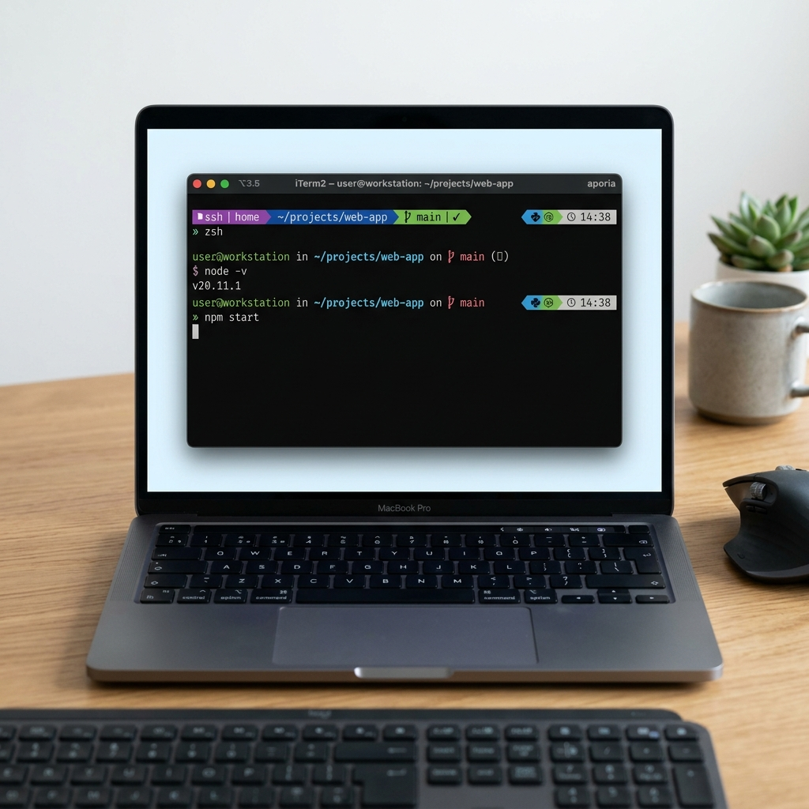

<div align="center">
  <h1>Aporia</h1>
  <p><b>Deep Blue · Context-Aware · High-Performance</b></p>
  <p>A professional Zsh theme designed for developers who demand a state-of-the-art terminal environment.</p>

  <a href="https://github.com/fr3on/aporia/releases/tag/1.1.0"></a>
  <a href="https://github.com/fr3on/aporia/actions/workflows/ci.yml"></a>
  <a href="LICENSE"></a>
  
</div>


## The Aporia Philosophy
Aporia isn't just a prompt; it's a **context-aware environment**. It adapts dynamically to your project, your privileges, and your operating system—staying minimal when you're busy and providing deep insights when you need them.

### Core Features
*   **Asynchronous Prompt Engine**: Native non-blocking background workers (`zle -F`) for instant terminal snappiness.
*   **Theme Presets**: Switch between `deep_blue`, `light`, and `amber` color palettes via `AP_THEME`.
*   **Adaptive Branding**: Official high-fidelity icons for macOS, Debian, Ubuntu, Arch, and more.
*   **Polyglot Awareness**: Real-time project detection for **Go, Rust, Python, Node, Ruby, PHP, Java, and C++**.
*   **Contextual Intelligence**: New Git stash tracking and dedicated segments for Virtual Environments and Docker.
*   **Aporia Essentials**: Built-in support for ghost-text **Autosuggestions** and live **Syntax Highlighting**.


## Compatibility

Aporia is designed for native performance across Unix-like systems. It is formally compatible with:

*   **macOS**: Native optimized support via Homebrew or standard install.
*   **Linux**: Full support for Debian, Ubuntu, Arch, Fedora, Alpine, and more.
*   **Windows**: Supported via **WSL2** (requires a Nerd Font installed on the Windows side).

**Requirements**:
- **Zsh**: Version 5.2 or newer.
- **Font**: A [Nerd Font](https://www.nerdfonts.com) (e.g., JetBrainsMono, Hack) for high-fidelity icons.


## Installation

### 1-Click Install (Universal)
The fastest way to get started on any system:
```bash
curl -fsSL https://raw.githubusercontent.com/fr3on/aporia/main/install.sh | zsh
```

### Homebrew (macOS)
The professional way to manage Aporia on your Mac:
```bash
brew tap fr3on/aporia https://github.com/fr3on/aporia
brew install aporia
```
*Note: Make sure to add `source $(brew --prefix)/share/aporia/aporia.zsh-theme` to your `.zshrc`.*

### Plugin Managers
| Manager | Configuration |
| :--- | :--- |
| **Oh My Zsh** | `git clone https://github.com/fr3on/aporia $ZSH_CUSTOM/themes/aporia`<br/>*Set `ZSH_THEME="aporia/aporia"` in `.zshrc`* |
| **Zinit** | `zinit ice pick"aporia.zsh-theme"; zinit light fr3on/aporia` |
| **Antigen** | `antigen theme fr3on/aporia` |
| **Zplug** | `zplug "fr3on/aporia", as:theme` |


## Plugin System

Aporia features a modular plugin system that keeps your prompt fast while giving you the tools you need. Plugins are opt-in and handled via the `AP_PLUGINS` array.

> [!TIP]
> **New to Aporia plugins?** Check out our **[Detailed Plugin Guide (with examples)](PLUGINS.md)** to see how each feature works!

### Quick Start
The easiest way to enable features is to use the built-in activation command:
```zsh
aporia-activate-plugin <name>
```

Alternatively, you can manually define the `AP_PLUGINS` array in your `~/.zshrc` before the theme is sourced:
```zsh
AP_PLUGINS=(sudo docker-ctx fast-syntax-highlighting)
source ~/.aporia.zsh-theme
```

### Available Plugins

| Plugin | Description | Depends on | Install |
|---|---|---|---|
| `history-substring-search` | `↑`/`↓` searches history by typed prefix | none | `aporia-install-plugin history-substring-search` |
| `autopair` | Auto-closes `"`, `'`, `(`, `[`, `` ` `` | none | `aporia-install-plugin autopair` |
| `you-should-use` | Reminds you when a shorter alias exists | none | `aporia-install-plugin you-should-use` |
| `fast-syntax-highlighting` | Drop-in FSH replacement (faster, themeable) | none | `aporia-install-plugin fast-syntax-highlighting` |
| `fzf-tab` | Replaces tab completion menu with fzf | `fzf` | `aporia-install-plugin fzf-tab` |
| `fzf-history` | Replaces `Ctrl+R` with fzf history browser | `fzf` | `aporia-install-plugin fzf-history` |
| `docker-ctx` | Shows Docker context in prompt (no subprocess) | none | bundled |
| `kube-ctx` | Shows kubectl context:namespace (no kubectl) | `kubectl` on PATH | bundled |
| `aws-profile` | Shows `$AWS_PROFILE` + region, red on prod | none | bundled |
| `proxmox` | Detects Proxmox Host nodes and Guest VMs | none | bundled |
| `autoswitch-venv` | Auto-activates virtualenv on `cd` | none | `aporia-install-plugin autoswitch-venv` |
| `nix-shell` | Shows active Nix/devenv shell | none | bundled |
| `forgit` | `fzf`-powered interactive `git` workflows | `fzf`, `git` | `aporia-install-plugin forgit` |
| `sudo` | Double `ESC` → prepend `sudo` | none | bundled |

### Plugin Management
*   **`aporia-install-plugin <name>`**: Installs a third-party plugin from its upstream repository.
*   **`aporia-activate-plugin <name>`**: Installs (if missing) and activates a plugin in your current session and `~/.zshrc`.
*   **`aporia-activate-all`**: Automatically activates all plugins currently installed on your system.
*   **`aporia-update-plugins`**: Pulls the latest changes for all your installed plugins.
*   **`aporia-list-plugins`**: Shows which plugins are installed and which are currently active.


## Configuration
Override these variables in your `~/.zshrc` *before* the theme is sourced to customize your experience:

| Variable | Default | Description |
| :--- | :--- | :--- |
| `AP_THEME` | `deep_blue` | Color preset: `deep_blue`, `light`, or `amber` |
| `AP_USE_NERD_FONT` | `1` | Set to `0` for fallback Unicode characters |
| `AP_ASCII_FALLBACK` | `0` | Set to `1` to use ASCII separators instead of Nerd Fonts |
| `AP_SHOW_SSH` | `1` | Show SSH context (user@host) |
| `AP_SHOW_GIT` | `1` | Show Git status and upstream info |
| `AP_SHOW_LANGS` | `1` | Show language versions (only inside projects) |
| `AP_SHOW_EXEC_TIME` | `1` | Show command execution timing |
| `AP_EXEC_TIME_THRESHOLD` | `2` | Minimum duration (s) to show timing |
| `AP_SHOW_EXIT_CODE` | `1` | Show non-zero exit codes |
| `AP_SHOW_TIME` | `1` | Show the right-side clock |
| `AP_DIR_DEPTH` | `3` | Number of directory segments to show |


## Troubleshooting

> [!IMPORTANT]
> **Icons appearing as squares?**
> 1. Ensure you are using a [Nerd Font](https://www.nerdfonts.com) (we recommend **JetBrainsMono**).
> 2. Check your locale: Run `locale` and ensure `LANG` includes `UTF-8`.
> 3. If you cannot use Nerd Fonts, set `AP_ASCII_FALLBACK=1` in your `.zshrc`.


## License
MIT © **Ahmed Mardi (fr3on)**
